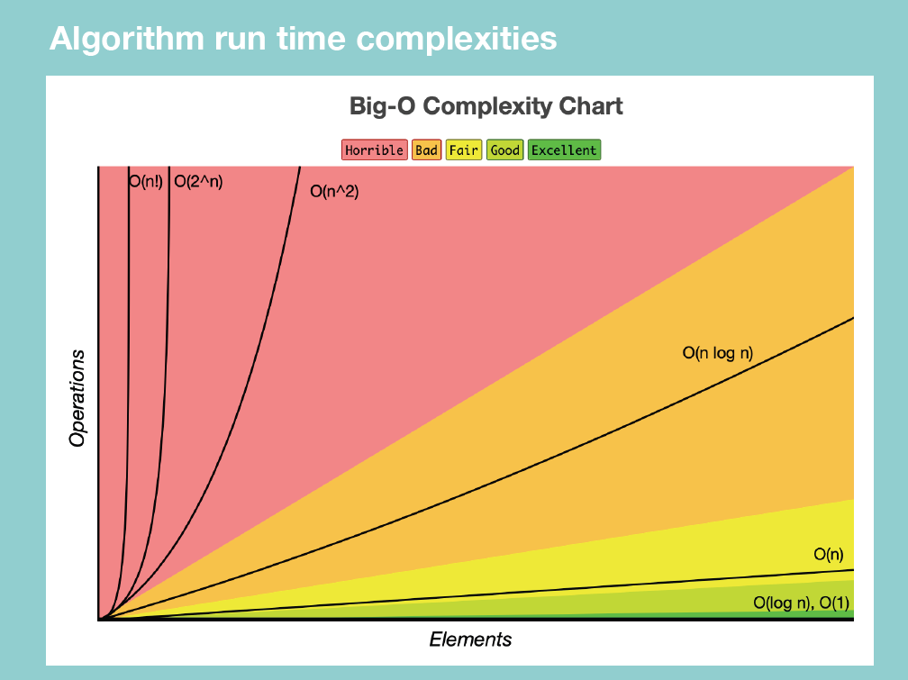

# 🧮 Big-O Notation & Complexity Analysis

As a programmer, you should always ask two questions:
1. ⏱️ How much **time** does my algorithm need to finish?
2. 💾 How much **space** (memory) does it need to compute?

To answer this, computer scientists introduced **Big-O Notation** — a mathematical way to describe algorithm efficiency.

---

## ⚙️ Big-O Notation

- A **mathematical metric** used to describe the efficiency of an algorithm in terms of **time** and **space** as the input size grows.  
- Focuses on the **worst-case scenario**, ignoring constant factors and lower-order terms.  
- Helps compare multiple solutions and choose the most efficient one.  

### ✅ Key Tips
- **Big-O focuses on growth rate**, not actual time.
- **Ignore constants and smaller terms** → `O(2n)` becomes `O(n)`.
- It depends on both the **input data** and the **system** it runs on.
- Commonly used to **compare scalability** of algorithms.

---

## 🧠 Time Complexity
Time complexity measures **how the number of operations grows** with the input size `n`.

> “If I double the input size, how much more work does my algorithm do?”

---

## 💾 Space Complexity
Space complexity measures **how much extra memory** (besides input storage) the algorithm uses.

---

## ⚖️ Types of Big-O Scenarios
Every algorithm can be analyzed in three cases:

| Case | Notation | Meaning |
|------|-----------|----------|
| **Best Case** | Ω (Omega) | Minimum time the algorithm will take |
| **Average Case** | Θ (Theta) | Expected or normal case |
| **Worst Case** | O (Big-O) | Maximum time taken — most important for analysis |

> ✅ Always focus on the **worst case** to measure real efficiency.

---

## 📈 Big-O Runtime Complexities

| **Big-O** | **Name** | **Description** | **Example** |
|------------|-----------|------------------|-------------|
| **O(1)** | Constant Time | Execution time does not depend on input size. | Accessing an array element |
| **O(log n)** | Logarithmic Time | Input size is reduced by half each step. | Binary Search |
| **O(n)** | Linear Time | Time grows proportionally with input size. | Iterating through a list |
| **O(n log n)** | Linearithmic Time | Slightly worse than linear, common in sorting. | Merge Sort, Quick Sort (avg) |
| **O(n²)** | Quadratic Time | Time grows with the square of input size. | Nested loops, Bubble Sort |
| **O(2ⁿ)** | Exponential Time | Time doubles with each additional input. | Recursive subset generation |
| **O(n!)** | Factorial Time | Extremely slow growth, impractical for large n. | Traveling Salesman brute force |

---

## 🚀 Examples

### 🔹 Constant Time — O(1)
Even if the input increases, execution time remains **the same**.

```python
def mul_nums(n):
    return n * n
```

- Runs in constant time — **1 operation**, regardless of `n`.

---

### 🔹 Linear Time — O(n)
Time increases **proportionally** with the input size.

```python
def printNum(n):
    for i in range(n):
        print(i)
```

- As `n` grows, the number of operations grows linearly.

---

### 🔹 Drop Constants
Ignore constant factors because they don’t affect growth for large inputs.

```python
# Example
# Two loops -> O(2n)
# Simplified -> O(n)
```

✅ Big-O simplifies to what matters most — **growth rate**.

---

### 🔹 Quadratic Time — O(n²)
Occurs in **nested loops**, where each loop runs `n` times.

```python
for i in range(n):
    for j in range(n):
        print(i, j)
```

- The total operations ≈ `n * n = n²`.
- Becomes inefficient as input grows.

---

### 🔹 Drop Non-Dominant Terms
When combining different complexities, **keep only the dominant term**.

```python
# Example: O(n² + n)
# Drop smaller term (O(n))
# Final: O(n²)
```

---

### 🔹 Logarithmic Time — O(log n)
Occurs when the **input is divided** into smaller parts each step (e.g., half).

- Used in **Divide and Conquer** algorithms.
- The problem size reduces exponentially fast.

```python
# Example: Binary Search
# Divide the array in half each iteration until the target is found
```

- Only ~10 steps needed for 1,000 elements (log₂1000 ≈ 10).  
- Very efficient!

---

## 🧮 Space Complexity
Measures how much memory an algorithm uses in the **worst-case scenario**.

- Includes temporary variables, recursion stack, and data structures used.

---

## 🧾 How to Measure Complexity — 5 Simple Rules

| **Rule** | **Description** | **Complexity** |
|-----------|------------------|----------------|
| 1 | Any assignment or if-statement executed once | **O(1)** |
| 2 | A simple `for` loop from `0` to `n` (no internal loops) | **O(n)** |
| 3 | A nested loop of the same type | **O(n²)** |
| 4 | A loop where the control variable is divided by 2 each step | **O(log n)** |
| 5 | Multiple statements — add them up, then keep the dominant term | **Simplified Big O** |

---

## 💬 Key Takeaways

- Big-O helps you **compare efficiency** and **predict scalability**.  
- Always **simplify** using:
  - Drop constants (`O(2n)` → `O(n)`)
  - Drop lower-order terms (`O(n² + n)` → `O(n²)`)
- Focus on the **dominant growth pattern**.
- Choose algorithms that scale well: aim for **O(log n)** or **O(n)** when possible.

---

> ✨ **In short:**  
> Big-O is not about *how fast your computer runs the code* —  
> It’s about *how fast your algorithm grows* when the input gets large.


