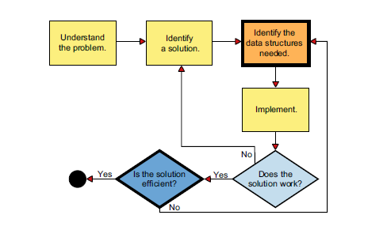

# Data-Structure
- Data structures are the way of organizing and storing the data or info in a computer or in a program which helps to efficiently mangae and manipulate data.
- It defines the relationship between the data elements, the operations that
can be performed, and the rules or constraints for accessing and modifying the data.
- A Data Structure is the way of orginizing data so that it can be used effectively.
- Essential ingredients to creating fast and powerful algorithms.
- makes code cleaner and easier to understand.
- good code results in great product.

## Algorithm
- An algorithm is a set of well-defined instructions, a step-by-step procedure designed
to solve a specific problem or perform a particular task.
- Algorithms are used to describe the operations performed on data
structures.
- To use an analogy, data structures are like nouns, while algorithms
are more like verbs.

## Data Structure and Algorithm
- Data structures and algorithms are interdependent.
- Data structures provide the organization and representation of information (the data),
and algorithms serve as instructions for transforming that data. Each data structure
implicitly defines algorithms for operations, such as adding, retrieving, and removing its
elements.

## Why Data Structure 
- DS are the building blocks of Computer science.
- helps to organize data
- solve difficult problem
- improve the efficiency
- optimize memory usage
- avoid security risk

## How do we use DS:

## Abstract Data Type
- ADT is conceptual model that defines and classify data structure based on how they are used and what they provide.
- They dont specify about how the data structure is implemented or in what programming language they follow.

### Example of ADT
| **Abstract Data Type (ADT)** | **Conceptual Description (What it does)** | **Common Implementations (How it's built)** |
|------------------------------|-------------------------------------------|---------------------------------------------|
| **List**                    | A sequential collection of elements accessible by index. | Array (or Dynamic Array/ArrayList), Linked List (Singly or Doubly Linked) |
| **Stack**                   | A Last-In, First-Out (LIFO) collection, like a stack of plates. | Array, Linked List |
| **Queue**                   | A First-In, First-Out (FIFO) collection, like people in a line. | Array, Linked List |
| **Set**                     | An unordered collection of unique elements. | Hash Table (or HashSet), Binary Search Tree (BST), Sorted Array |
| **Map (Dictionary)**        | Stores key-value pairs, allowing retrieval by unique key. | Hash Table (or HashMap), Binary Search Tree (or TreeMap), Balanced Tree (e.g., Red-Black Tree) |
| **Priority Queue**          | A collection where elements are removed based on priority, not insertion order. | Heap (often implemented using an Array), Binary Search Tree |
| **Graph**                   | A collection of nodes (vertices) and connections (edges). | Adjacency Matrix, Adjacency List (using an Array of Linked Lists or Hash Maps) |
| **Tree**                    | A hierarchical structure of nodes. | Linked Nodes (using pointers/references), Array (especially for complete trees like Heaps) |

## Big-O
### Complexity Analysis
- As a programmer you should be aware of 2 things- How much time does this algorithm need to finish and how much space does this need to compute.
- To know this the scientist discovered the Big-O Notation
### Big-O Notation
- mathematical way to describe the efficienct of an algorithm in terms of time and space complexity as the input grow.
- It focuses on the worst-case scenario and ignores constant factors and lower-order terms, giving a high-level view of how an algorithm scales.

### Big-O Notation Cheat Sheet

| **Big-O**    | **Name**           | **Description**                                   | **Example**                     |
|--------------|--------------------|---------------------------------------------------|---------------------------------|
| **O(1)**     | Constant Time      | Execution time does not depend on input size.    | Accessing an array element      |
| **O(log n)** | Logarithmic Time   | Time grows slowly as input size increases.       | Binary Search                   |
| **O(n)**     | Linear Time        | Time grows proportionally with input size.       | Iterating through a list        |
| **O(n log n)**| Linearithmic Time | Slightly worse than linear, common in sorting.   | Merge Sort, Quick Sort (avg)    |
| **O(n²)**    | Quadratic Time     | Time grows with square of input size.            | Nested loops, Bubble Sort       |
| **O(2^n)**   | Exponential Time   | Time doubles with each additional input element. | Recursive subset generation     |
| **O(n!)**    | Factorial Time     | Extremely slow growth, impractical for large n.  | Traveling Salesman brute force  |

### ✅ Tips:
- **Big-O focuses on growth rate**, not exact time.
- **Ignore constants and lower-order terms** (e.g., O(2n) → O(n)).
- Common use: Compare algorithms for scalability.

### Time Complexity
- Time complexity tells how many operations your algorithm performs relative to input size —
it measures growth, not actual execution time.
- If I double the input size, how much more work does my code do?

### Space Complexity
- Space complexity tells how much extra memory your program uses (besides inputs).

## 📝 Topics
- 📊 [Arrays](./Arrays/)
- 🔗 [Linked Lists](./Linked-Lists/)
- 🧱 [Stacks](./Stacks/)
- 📥 [Queues](./Queues/)
- 🧮 [Hash Tables](./Hash-Tables/)
- 🌳 [Trees](./Trees/)
- 🌲 [Binary Search Trees](./Binary-Search-Trees/)
- ⛰️ [Heaps](./Heaps/)
- 🕸️ [Graphs](./Graphs/)
- 🔤 [Trie](./Trie/)
- 🧬 [Union Find](./Union-Find/)

## 📺 YouTube Playlists
- [William Fiset's Data Structure Playlist](https://www.youtube.com/playlist?list=PLDV1Zeh2NRsB6SWUrDFW2RmDotAfPbeHu)
- 

## Courses
-[Coursera Data Structure](https://www.coursera.org/programs/aptiv-integration-intended-l5k7z/learn/data-structures?authProvider=aptiv)
-[Python] (https://www.coursera.org/learn/python-data)
