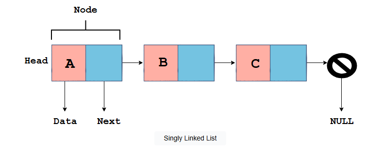
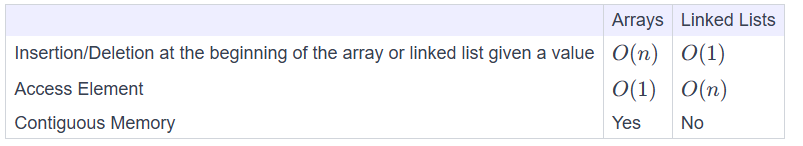

# Linked List

## Types
Singly Linked Lists
Doubly Linked Lists
Circular Linked List

## Structure
Every linked list consists of nodes, as shown in the illustration above. Every node has two components:

Data - store an element of data
Next - a pointer that points from one node to another.

## Arrays vs. Linked Lists

